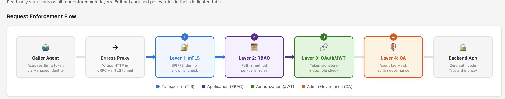
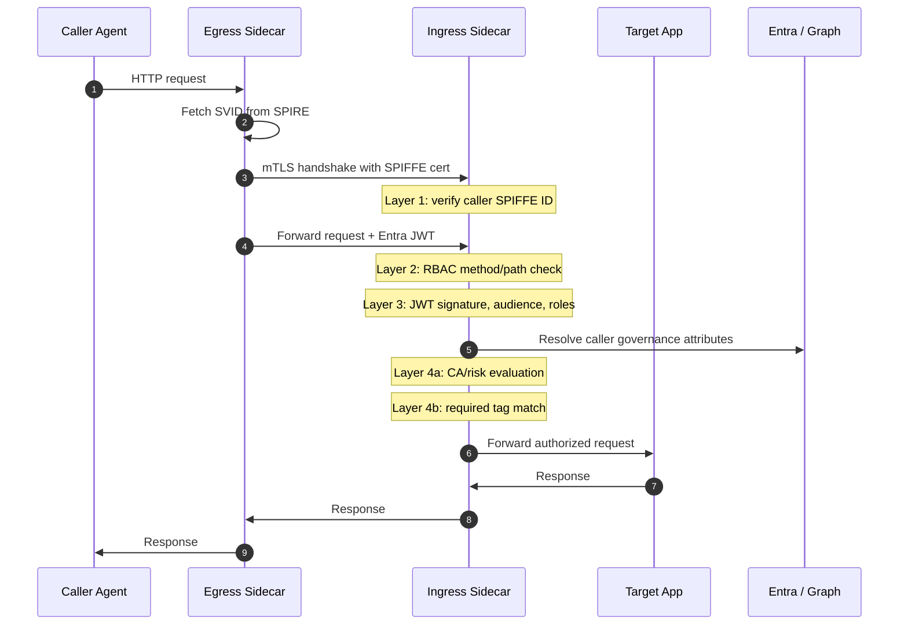
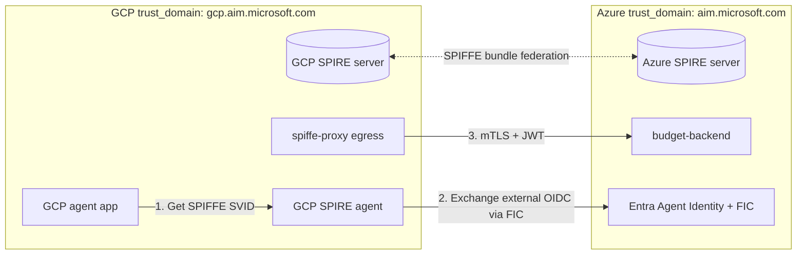
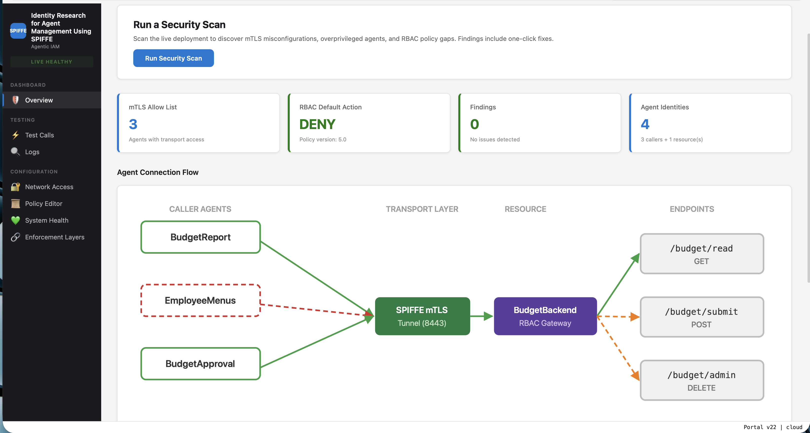
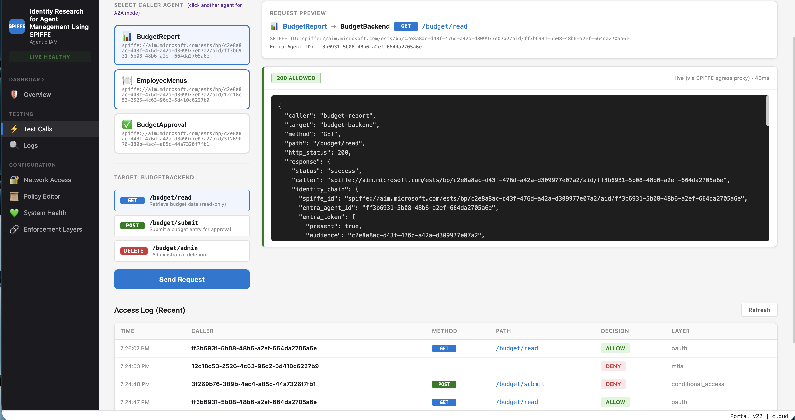
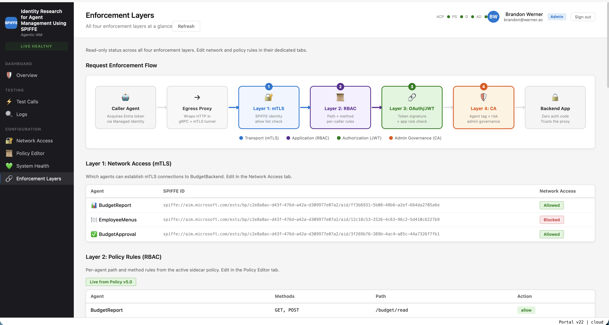
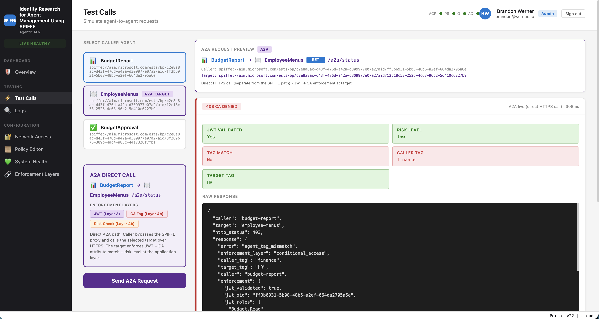

# Identity Research for Agent Management Using SPIFFE

> A working prototype for governing agent-to-agent traffic with **Microsoft Entra Agent Identity**, **SPIFFE/SPIRE workload identity**, and sidecar-enforced policy. The sample runs on Azure Container Apps and includes optional GCP and GitHub Actions federation paths with no shared secrets.

This repository is the public baseline for Identity Research for Agent Management Using SPIFFE. The README is the landing page; the full architecture, setup guide, and API reference are published through GitHub Pages:

**Docs and API reference:** <https://microsoft.github.io/identity-spiffe/>

## What this demonstrates

- A sidecar that enforces mTLS, route-level RBAC, JWT validation, Conditional Access-style risk signals, and live admin governance before traffic reaches the app.
- Entra Agent Identity provisioning for Azure-native agents and federated external callers.
- SPIFFE/SPIRE SVIDs for workload-to-workload mTLS, including optional cross-cloud bundle federation.
- A portal and admin control plane for policy, health, audit, token, and mTLS allow-list management.
- Deployable examples for Azure agents, a GCP-hosted agent, and a GitHub Actions federated caller.

## Enforcement model

Every governed call passes through independent checks. Any failed layer denies the request.

<p align="center">
  
  <br>
  <em>The live <strong>Enforcement Layers</strong> view in the portal — every governed request walks all four layers before the backend ever sees it.</em>
</p>

| Layer | Enforcement point | Denies when |
|---:|---|---|
| 1 | SPIFFE/SPIRE mTLS in `spiffe-proxy` | Caller SPIFFE ID is not allowed by the target |
| 2 | Sidecar RBAC policy | Method/path is not permitted for that caller |
| 3 | Entra OAuth2/JWT validation | Token is missing, expired, wrong audience, or lacks role |
| 4a | Conditional Access-style risk evaluation | Caller risk or governance state is unacceptable |
| 4b | Admin tag governance | Required live Graph-backed tags are absent |

## Architecture graphs

### System topology


### Five-layer call flow



### Cross-cloud federation



## Quick start

Read the [GitHub Pages quickstart](https://microsoft.github.io/identity-spiffe/getting-started/quickstart/) for prerequisites and the full deployment path.

The common commands are:

```bash
az login
azd auth login
azd env new isp-example

# Azure-only environment (seed the portal admin with the identity you'll sign in as)
./deploy.sh --new --with-admin=you@your-tenant.com

# Existing environment, code changes only
./deploy.sh --skip-provision

# Optional federated callers
./deploy.sh --new --google
./deploy.sh --new --github
```

> **Portal sign-in tip.** `deploy.sh` only adds the signed-in `az login` user
> to the `Agent Management Administrators` group by default. If you'll sign
> into the portal with a different identity, pass `--with-admin=<upn>`
> (repeatable) or set `ISP_INITIAL_ADMINS=alice@contoso.com,bob@contoso.com`.
> Use `./scripts/portal-members.sh add-admin <upn>` to add more admins (or
> `add-viewer`, `remove-admin`, `list`) after deploy.

Important deployment rules:

- Do not use `azd deploy <service>` for agent services. Use `./deploy.sh --skip-provision` or `./scripts/reattest.sh`.
- Do not use `az containerapp update --set-env-vars` on multi-container apps. Export full YAML, edit it, then reimport.
- Do not use `az vm run-command invoke`. Use the helper path that calls `az vm run-command create --timeout-in-seconds`.

## Portal tour

The portal (`isp-portal`) is the operator surface for everything the sidecars
enforce — a live read of policy, identity, transport, and audit, plus the
controls to change them. Sign-in is gated by Entra; group membership in
`Agent Management Administrators` unlocks the policy editor and network
controls, `Agent Management Viewers` gets read-only access.

<p align="center">
  <a href="docs/assets/portal/overview.png">
    
  </a>
  <br>
  <em>The overview dashboard at a glance — live health, one-click security scan, and the agent connection flow color-coded by enforcement decision.</em>
</p>

<table align="center">
  <tr>
    <td align="center" width="50%">
      <a href="docs/assets/portal/test-calls.png">
        
      </a>
      <br>
      <strong>Test Calls</strong><br>
      <sub>Fire real requests through the live SPIFFE egress proxy and watch the identity chain, response, and access log decisions land in real time.</sub>
    </td>
    <td align="center" width="50%">
      <a href="docs/assets/portal/enforcement-layers.png">
        
      </a>
      <br>
      <strong>Enforcement Layers</strong><br>
      <sub>Read-only status across all four layers — mTLS allow list, RBAC rules, OAuth role bindings, and CA governance — pulled live from the sidecar.</sub>
    </td>
  </tr>
  <tr>
    <td align="center" colspan="2">
      <a href="docs/assets/portal/a2a-test-call.png">
        
      </a>
      <br>
      <strong>Agent-to-agent (A2A) governance</strong><br>
      <sub>Direct HTTPS call <em>between</em> agents — bypassing the SPIFFE tunnel — so the <strong>target</strong> enforces JWT, Conditional Access tags, and risk at the application layer. Here BudgetReport (<code>finance</code>) tries to read EmployeeMenus (<code>HR</code>): JWT validates and risk is low, but the CA tag mismatch returns a clean <code>403 agent_tag_mismatch</code> with the exact enforcement layer that denied it.</sub>
    </td>
  </tr>
</table>

Behind those screens are dedicated **Network Access**, **Policy Editor**,
**System Health**, **Test Calls**, and **Logs** pages. See the
[architecture overview](https://microsoft.github.io/identity-spiffe/architecture/system-overview/)
for how each page maps to a sidecar or control-plane API.

## Repository map

| Path | Purpose |
|---|---|
| `src/spiffe-proxy/` | Go sidecar implementing mTLS, RBAC, JWT validation, audit streaming, and `/mgmt/*` |
| `src/shared/` | Shared Python credential providers, token exchange, CA evaluation, and JWT validation |
| `src/budget-*`, `src/employee-menus/`, `src/demo-agent/` | Sample agents and target services |
| `src/admin-control-plane/` | Management front door for protected sidecar APIs |
| `portal/` | Entra-signed-in management portal and API backend |
| `securityportal-mock/` | Mock SOC/risk signal source used by the demo |
| `infra/` | Bicep modules for Azure infrastructure |
| `scripts/` | Deployment, Entra bootstrap, federation setup, re-attestation, and validation scripts |
| `docs/` | GitHub Pages documentation and API reference |

## Documentation

- [Quickstart](https://microsoft.github.io/identity-spiffe/getting-started/quickstart/)
- [System overview](https://microsoft.github.io/identity-spiffe/architecture/system-overview/)
- [Management APIs](https://microsoft.github.io/identity-spiffe/reference/management-apis/)
- [Authentication flows](https://microsoft.github.io/identity-spiffe/reference/authentication-flows/)
- [Google federation how-to](GOOGLE-FEDERATION-HOWTO.md)
- [GitHub Actions federation how-to](GITHUB-FEDERATION-HOWTO.md)

Local docs preview:

```bash
python3 -m pip install -r requirements-docs.txt
mkdocs serve
```

## Validation

Run the enforcement matrix after deployment:

```bash
python3 scripts/test_agents.py
```

Useful operational checks:

```bash
./scripts/current-deployment.sh
./scripts/reattest.sh
mkdocs build --strict
```

## Contributing, support, and license

- [Contributing](CONTRIBUTING.md)
- [Code of conduct](CODE_OF_CONDUCT.md)
- [Support](SUPPORT.md)
- [Security reporting](SECURITY.md)
- [MIT License](LICENSE)

This is a prototype. It is designed to show the pattern and make the implementation copyable, not to be run unchanged as a production platform.
