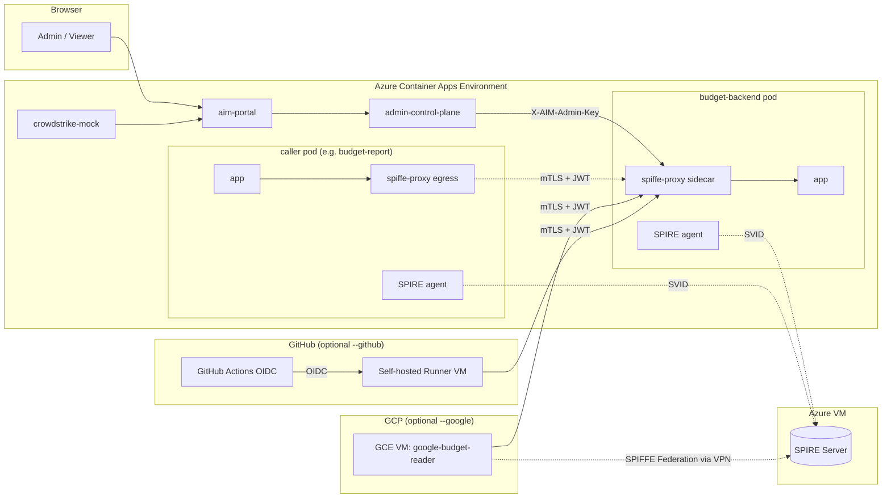
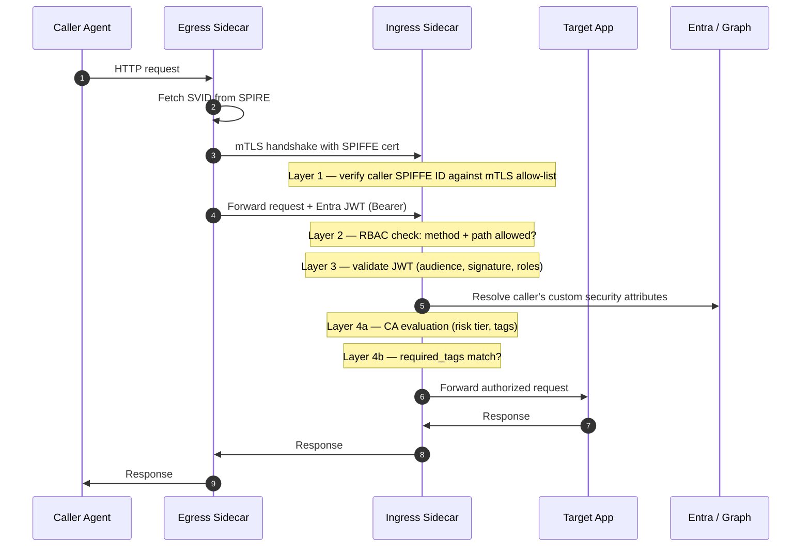
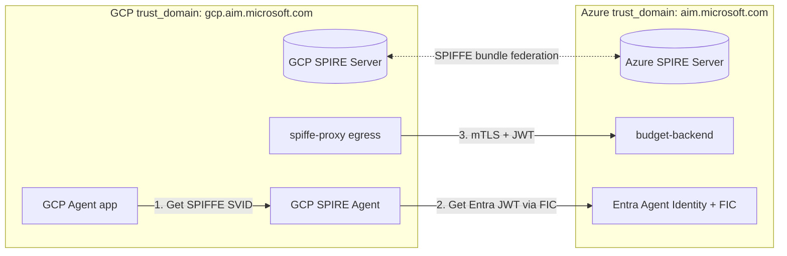

# AIM Prototype Platform

> **Agentic Identity Management for Azure** — a working proof-of-concept showing how to govern agent-to-agent traffic across Azure, GCP, and GitHub Actions with **zero shared secrets** and **five independent enforcement layers**.

Project AIM demonstrates a production-grade pattern for identity, authorization, and runtime governance when the callers are not humans but autonomous agents (services, workflows, LLM-driven workers). It combines **Microsoft Entra Agent Identity**, **SPIFFE/SPIRE workload identity**, **sidecar-enforced RBAC**, and **Conditional Access** into a single stack that works identically for domestic (Azure-native), cross-cloud (GCP), and hosted-CI (GitHub Actions) workloads.

**What you can do with this repo:**

- Deploy the full platform end-to-end with one command: `./deploy.sh --new`
- Add a GCP-hosted agent that authenticates to Azure services with no pre-shared secret: `./deploy.sh --new --google`
- Add a GitHub Actions workflow that calls Azure services via short-lived federated credentials: `./deploy.sh --new --github`
- Watch every authorization decision in real time through a live SSE-streamed audit log in the portal
- Break any of the five enforcement layers in the portal and see the call fail at runtime — policy-as-code with no redeploy

---

## Table of Contents

- [The Problem This Solves](#the-problem-this-solves)
- [The Five Enforcement Layers](#the-five-enforcement-layers)
- [Architecture](#architecture)
- [Scenarios the Repo Ships With](#scenarios-the-repo-ships-with)
- [Deployment](#deployment)
  - [Prerequisites](#prerequisites)
  - [Full list of `deploy.sh` flags](#full-list-of-deploysh-flags)
  - [Cross-cloud: Google Cloud federation](#cross-cloud-google-cloud-federation)
  - [Hosted CI: GitHub Actions federation](#hosted-ci-github-actions-federation)
- [Management Portal](#management-portal)
- [API Surface](#api-surface)
  - [Portal API](#portal-api)
  - [Admin Control Plane (`/admin/*`)](#admin-control-plane-admin)
  - [Protected Sidecar (`/mgmt/*`)](#protected-sidecar-mgmt)
- [Security Controls](#security-controls)
- [Parallel Deployments](#parallel-deployments)
- [Repository Map](#repository-map)
- [Validation & Troubleshooting](#validation--troubleshooting)
- [Deeper Documentation](#deeper-documentation)

---

## The Problem This Solves

Modern workloads are rarely "one service calls another." A GitHub Actions run calls an Azure API, which calls a GCP service, which triggers a Kubernetes job that calls a third-party SaaS. Each hop traditionally needs a long-lived secret — a client secret in GitHub Secrets, a service account JSON on disk, an API key in Key Vault. Every secret is a rotation burden, an audit gap, and a blast radius.

AIM replaces shared secrets with **provable workload identity at every hop**, and enforces authorization at **five independent control points** so a failure at any single layer does not grant access.

## The Five Enforcement Layers

Every agent-to-agent call flows through all five layers. Each layer fails closed independently.

| Layer | Control Point | Fails Closed On |
|:---:|---|---|
| **1. Transport (mTLS)** | SPIFFE/SPIRE-issued X.509 SVIDs in a sidecar proxy | Caller SPIFFE ID not in the target's allow-list → connection refused |
| **2. Authorization (RBAC)** | Per-route YAML policy in the sidecar | Method/path combination not allowed for caller → `403` |
| **3. Identity (JWT)** | Entra Agent Identity OAuth2 tokens validated in the sidecar | Token missing, expired, wrong audience, or missing role → `401` |
| **4a. Conditional Access** | CrowdStrike-style risk signals + Entra CA policies | High-risk caller or non-matching tag → blocked at runtime |
| **4b. Admin Governance** | Tag-based policy evaluated against live Graph state | Policy admin revokes a tag and the next call fails without redeploy |

All five layers are observable in the portal's **Live Authorization Log** (SSE-streamed) and queryable via `/api/audit`.

## Architecture

### System Topology



### Call Flow — Five Layers



### Cross-Cloud Federation (GCP)



## Scenarios the Repo Ships With

The `budget-backend` scenario models a finance governance problem where some agents read budgets, one can approve, one should be blocked, and an external CI workflow checks balance before running expensive jobs.

| Agent | Host | Role | Expected Behavior |
|---|---|---|---|
| `budget-report` | Azure | Read-only caller | `GET /budget/read` → `200` · `POST /budget/submit` → `403` |
| `budget-approval` | Azure | Privileged caller | Both `GET` and `POST` → `200` |
| `employee-menus` | Azure | Unauthorized caller | All routes → blocked at Layer 1 (mTLS) |
| `budget-backend` | Azure | Target / enforcement point | Runs all five layers |
| `admin-control-plane` | Azure | Management front door | Proxies `/mgmt/*` with `X-AIM-Admin-Key` |
| `google-budget-reader` | GCP | Cross-cloud federated caller | `GET /budget/read` → `200` via SPIFFE federation |
| `github-budget-reader` | GitHub self-hosted runner | Hosted-CI federated caller | `GET /budget/read` → `200` via Flexible FIC |

---

## Deployment

### Prerequisites

| Tool | Required for |
|---|---|
| `az` (Azure CLI) + logged in | All deployments |
| `azd` (Azure Developer CLI) + logged in | All deployments |
| Docker Desktop / Colima | Local portal dev |
| `gcloud` CLI + billing account | `--google` federation |
| `gh` CLI + repo push access | `--github` federation |
| `jq`, `curl`, `python3` ≥ 3.11 | Scripts and validation |

Create or select an `azd` environment (one per deployment):

```bash
az login
azd auth login
azd env new aim-myenv     # or: azd env select aim-myenv
```

### Full list of `deploy.sh` flags

| Flag | Effect |
|---|---|
| *(no flags)* | Default: rebuild code, redeploy. Use on an existing env after code changes. |
| `--new` | Full new-environment deploy. Runs Entra bootstrap, provisions all infra, deploys everything. |
| `--skip-provision` | Skip `azd provision` — rebuild and redeploy code only. Preserves agent SPIRE attestation. |
| `--portal-only` | Rebuild and redeploy only the portal + CrowdStrike-mock apps. Do **not** use for sidecar, SPIRE, agent, or Entra changes. |
| `--skip-build` | Skip container image rebuilds (reuse existing tags). |
| `--google` | Provision GCP VPN + GCE VM, set up SPIRE federation, register `google-budget-reader` Entra Agent Identity + FIC. Combine with `--new` or `--skip-provision`. |
| `--github` | Provision GitHub self-hosted runner VM, register `github-budget-reader` with a Flexible FIC (org-wide wildcard), install composite action. Combine with `--new` or `--skip-provision`. |
| `--verify` / `--no-verify` | Run (or skip) the post-deploy enforcement-matrix test. |
| `--portal` / `--no-portal` | Launch (or skip launching) the portal in a browser after deploy. |

#### Common deployment commands

```bash
# Fresh environment, Azure-only
./deploy.sh --new

# Add code changes to an existing environment (safe for agent sidecars)
./deploy.sh --skip-provision

# Rebuild portal UI only
./deploy.sh --portal-only

# Fresh environment with GCP cross-cloud agent
./deploy.sh --new --google

# Add GitHub Actions federated agent to an existing environment
./deploy.sh --skip-provision --github

# Both federations on a fresh environment
./deploy.sh --new --google --github

# Re-attest agent sidecars after touching SPIRE (does NOT rebuild images)
./scripts/reattest.sh

# Live deployment dashboard — all resources, identities, FICs, RBAC, spending
./scripts/current-deployment.sh
```

### Cross-cloud: Google Cloud federation

`--google` wires up a complete two-cloud identity chain with zero shared secrets:

1. **Phase 0 — Network:** Azure VNet with GatewaySubnet, VPN Gateway, matching GCP VPC + Classic Cloud VPN + IPsec tunnel
2. **Phase 1 — Identity:** Entra Agent Identity `google-budget-reader` + FIC binding to the GCP service account's numeric unique ID (not email — see [GOOGLE-FEDERATION-HOWTO.md](GOOGLE-FEDERATION-HOWTO.md))
3. **Phase 2 — Runtime:** GCE VM running SPIRE agent + spiffe-proxy + agent app (`TOKEN_SOURCE=google_oidc`), SPIFFE trust bundle exchange in both directions
4. **Wired into RBAC:** `federated_policies` entry with exact `spiffe_id` match (not prefix) — no whole-trust-domain authorization

**Token chain:** GCE metadata → Google OIDC → Entra FIC exchange → Entra Agent Identity JWT → Layer 3 validation at the sidecar. Three-hop exchange, observable in the portal's token-provenance view.

Step-by-step walk-through: [GOOGLE-FEDERATION-HOWTO.md](GOOGLE-FEDERATION-HOWTO.md)

### Hosted CI: GitHub Actions federation

`--github` solves the classic "GitHub Actions needs to call a protected Azure service" problem without a secret in GitHub Secrets.

1. **One Flexible FIC** on the Entra Blueprint app with claims expression `claims['sub'] matches 'repository_owner_id:<org-id>:*'` — trusts **any** repo in the org, **any** branch, **any** workflow. Scales past Entra's historical 20-FIC limit.
2. **Self-hosted runner** VM in the same Azure VNet. No VPN, no SPIRE federation — the runner is essentially a domestic agent with extra JWT claims.
3. **Reusable composite action** at `.github/actions/aim-auth` performs the OIDC → Entra two-hop exchange in any workflow.
4. **Per-repo scoping** via RBAC `required_tags` matched against JWT custom claims — the wildcard FIC admits the identity, but RBAC decides which repos can hit which endpoints.

Example workflow is in [`.github/workflows/aim-budget-check.yml`](.github/workflows/aim-budget-check.yml) and looks like:

```yaml
permissions:
  id-token: write       # the only credential-adjacent config in the whole repo
  contents: read
jobs:
  check:
    runs-on: [self-hosted, aim-runner]
    steps:
      - uses: actions/checkout@v4
      - uses: ./.github/actions/aim-auth     # OIDC → Entra two-hop exchange
      - run: curl -f http://localhost:8080/budget/read
```

Step-by-step walk-through: [GITHUB-FEDERATION-HOWTO.md](GITHUB-FEDERATION-HOWTO.md)

---

## Management Portal

The portal (`aim-portal` Container App) is the operator surface. It signs users in via Entra, gates access by `AIM Administrators` vs `AIM Viewers` group membership, and exposes:

- **Overview** — per-agent status cards (mTLS, RBAC, JWT, CA), clickable for detail
- **Agent Detail** — full config (SPIFFE ID, Entra OID, RBAC rules, mTLS allow-list state, CA tags) + a live-streaming filtered authorization log for just that agent
- **Logs** — top-level SSE-streamed audit log across all agents with search, filters, pinned agents, and `localStorage`-persisted preferences
- **Test Calls** — trigger governed A2A requests from the browser
- **Network Access** — mTLS allow-list editor
- **Policy Editor** — RBAC YAML editor with `domestic` and `federated_policies` sections, hot-reload
- **System Health** — live `/healthz/ready` checks across every dependency
- **Enforcement Layers** — per-layer live state (mTLS allow-list count, RBAC policy hash, JWT config, CA policy status)

## API Surface

### Portal API

**Public (no auth):**

| Route | Method | Purpose |
|---|---|---|
| `/` | `GET` | Serve the portal SPA |
| `/api/auth-config` | `GET` | MSAL bootstrap config (client_id, tenant) |
| `/healthz/live`, `/healthz/ready`, `/health` | `GET` | Liveness + readiness probes |

**Authenticated (viewer or admin):**

| Route | Method | Purpose |
|---|---|---|
| `/api/config` | `GET` | Environment metadata |
| `/api/system-status` | `GET` | Rollup status across all dependencies |
| `/api/health` | `GET` | Fine-grained health of each component |
| `/api/policy` | `GET` | Current RBAC policy YAML |
| `/api/audit` | `GET` | Recent authorization decisions (buffered) |
| `/api/audit/stream` | `GET` | **SSE** live stream of authorization decisions |
| `/api/mtls-policy` | `GET` | Current mTLS allow-list |
| `/api/metrics` | `GET` | Enforcement counters per caller |
| `/api/oauth-status` | `GET` | JWT validator state |
| `/api/ca-sample`, `/api/ca-policies`, `/api/ca-status` | `GET` | Conditional Access integration state |
| `/api/policy-configs`, `/api/preset-policies` | `GET` | Saved + preset policy bundles |
| `/api/identity-mapping` | `GET` | SPIFFE ↔ Entra OID mapping |
| `/api/enforcement-matrix` | `GET` | Cached result of the enforcement-matrix test |
| `/api/external-agents/{name}` | `GET` | Metadata for a federated agent |

**Admin-only (mutating):**

| Route | Method | Purpose |
|---|---|---|
| `/api/execute` | `POST` | Run a governed request through a selected caller |
| `/api/a2a-call` | `POST` | Run a direct A2A request |
| `/api/policy` | `PUT` | Update RBAC policy (hot-swap) |
| `/api/mtls-policy` | `PUT` | Update mTLS allow-list |
| `/api/policy-configs` | `POST` | Save a named policy config |
| `/api/policy-configs/{name}` | `DELETE` | Delete a named policy config |
| `/api/agent-risk` | `PUT` | Update risk/governance state (mock CrowdStrike) |
| `/api/sync-attributes` | `POST` | Pull Entra custom security attributes |
| `/api/flush-all-tokens` | `POST` | Flush cached Entra tokens |
| `/api/refresh-agents` | `POST` | Re-scan for federated agents |
| `/api/external-agents/{name}` | `PUT` / `DELETE` | CRUD on federated agent metadata |
| `/api/scan`, `/api/quick-fix`, `/api/reload-config` | `POST` | Operational actions |

### Admin Control Plane (`/admin/*`)

`admin-control-plane` is the public management front door. All routes require `X-AIM-Admin-Key`.

| Route | Method | Purpose |
|---|---|---|
| `/health` | `GET` | Liveness (no auth) |
| `/admin/agents` | `GET` | Discover all agents (domestic + federated) |
| `/admin/{mgmt_path}` | `GET`, `PUT` | Proxied passthrough to a protected sidecar's `/mgmt/*` |

### Protected Sidecar (`/mgmt/*`)

Exposed only on the sidecar's management port (`:9443`). All routes require `X-AIM-Admin-Key`. Not reachable from the public internet — only `admin-control-plane` and the in-pod app can call these.

| Route | Method | Purpose |
|---|---|---|
| `/mgmt/health` | `GET` | Sidecar health (SPIRE attestation, SVID TTL) |
| `/mgmt/policy` | `GET`, `PUT` | RBAC policy read/write (hot-swap) |
| `/mgmt/audit` | `GET` | Recent authorization decisions |
| `/mgmt/audit/stream` | `GET` | SSE fan-out of new decisions |
| `/mgmt/metrics` | `GET` | Enforcement counters per caller |
| `/mgmt/mtls-policy` | `GET`, `PUT` | Transport allow-list state |
| `/mgmt/oauth-status` | `GET` | JWT validator config |
| `/mgmt/agent-risk` | `GET`, `PUT` | Risk state (mock CrowdStrike) |
| `/mgmt/agent-tags` | `GET` | Synced Entra custom security attributes |
| `/mgmt/ca-policy-effective` | `GET` | Effective CA-derived per-agent state |

---

## Security Controls

| Control | Where Enforced | Notes |
|---|---|---|
| **Fail-closed everywhere** | Sidecar + portal | Missing Graph data, missing tokens, unreachable dependencies all return deny, not allow. |
| **No shared secrets** | Entire platform | Every cross-boundary call uses short-lived Entra or SPIFFE credentials. GitHub Actions uses OIDC + Flexible FIC. GCP uses workload identity + FIC. |
| **Workload identity at every hop** | SPIFFE/SPIRE | Every agent gets an X.509 SVID rotated hourly. mTLS uses these certs, not server-shared TLS. |
| **Management key never sent to browser** | Portal backend | The browser authenticates to the portal with Entra. Portal backend attaches `X-AIM-Admin-Key` server-side when proxying to `/admin/*`. |
| **CodeQL scanning** | CI (`codeql.yml`) | Runs on every push. |
| **Dependency review** | CI | Prevents introducing known-vulnerable packages. |
| **Env-scoped identities** | Entra bootstrap | New environments create env-scoped Blueprints, Agent Identities, FICs, and portal app registrations — parallel deploys cannot cross-contaminate. |
| **Query-param token carveout** | Portal SSE endpoint only | `EventSource` cannot set `Authorization` headers, so the SSE route accepts a bearer via `?access_token=`. Token-in-URL risk is acknowledged and POC-scoped; cookies would be the production path. |

---

## Parallel Deployments

Multiple full AIM environments can coexist in the same Entra tenant. Env-scoped naming is the default for anything tenant-impactful:

**Env-scoped (one per environment):**

- Agent Identity Blueprints (`AIM-Blueprint-<env>`)
- Agent Identities (`<agent-name>-<env>`)
- Federated Identity Credentials (named after the agent)
- Portal app registrations

**Shared tenant-wide:**

- `AIM Administrators` and `AIM Viewers` security groups
- The provisioner app registration
- The Conditional Access schema and generic policy model

Details: [docs/developer/parallel-deployments.md](docs/developer/parallel-deployments.md)

## Repository Map

| Path | Purpose |
|---|---|
| `src/spiffe-proxy/` | **The heart of the platform.** Go sidecar proxy implementing mTLS, RBAC, JWT validation, CA evaluation, audit streaming, and the `/mgmt/*` API. |
| `src/shared/` | Shared Python: `entra_token_exchange.py` (strategy-pattern credential providers: Azure MI, Google OIDC, GitHub OIDC), `ca_evaluator.py`, `jwt_validator.py` |
| `src/budget-backend/` | The protected service (5-layer target). Python FastAPI. |
| `src/budget-report/`, `src/budget-approval/`, `src/employee-menus/`, `src/demo-agent/` | Caller agents exercising different policy outcomes. |
| `src/admin-control-plane/` | Public management front-door proxying `/admin/*` to sidecar `/mgmt/*`. |
| `portal/` | Portal backend (`portal/app/` modular FastAPI) + SPA (`portal/index.html`) |
| `crowdstrike-mock/` | Mock SOC portal generating risk signals and tag changes |
| `scripts/` | Entra bootstrap, GCP provisioning, GitHub runner setup, re-attestation, test harnesses, live deployment dashboard |
| `scripts/bootstrap-gcp-project.sh`, `scripts/provision-gce-vm.sh`, `scripts/provision-gcp-vpn.sh`, `scripts/setup-gce-agent.sh` | GCP cross-cloud federation |
| `scripts/add-github-agent.sh`, `scripts/setup-github-runner.sh` | GitHub Actions federation |
| `scripts/current-deployment.sh` | Live status dashboard (all resources, identity, FICs, RBAC, spending) |
| `scripts/test_agents.py` | Full enforcement-matrix integration test |
| `infra/` | Bicep: Container Apps, VMs, ACR, VNet, VPN Gateway, Key Vault, Blob Storage |
| `.github/actions/aim-auth/` | Reusable composite action for GitHub Actions federation |
| `.github/workflows/` | Example workflow (`aim-budget-check.yml`) + CI + CodeQL + docs build |
| `docs/` | Full architecture, reference, runbooks, ADRs (GitHub Pages) |
| `agency.toml` | Azure AI Agent Service deployment descriptor |
| `deploy.sh` | The single-command deployment entry point |

## Validation & Troubleshooting

Run the full enforcement-matrix test (exercises all five layers across all agents):

```bash
python3 scripts/test_agents.py
```

Live status dashboard:

```bash
./scripts/current-deployment.sh
```

Re-attest agent sidecars after touching SPIRE (the sidecars lose their SVID when the SPIRE server restarts):

```bash
./scripts/reattest.sh
```

Common pitfalls documented in [`AGENTS.md`](AGENTS.md) and [`CLAUDE.md`](CLAUDE.md):

- Don't use `azd deploy <service>` for agent services — it breaks SPIRE attestation. Use `./deploy.sh --skip-provision` or `./scripts/reattest.sh`.
- Don't use `az containerapp update --set-env-vars` on multi-container apps — it drops sidecars. Export YAML, edit, reimport.
- Don't use `az vm run-command invoke` — use `az vm run-command create --timeout-in-seconds` (the `invoke` variant has no timeout and can permanently block the VM).

## Deeper Documentation

The `docs/` tree is published via GitHub Pages (configured in [`.github/workflows/docs.yml`](.github/workflows/docs.yml)). Preview locally:

```bash
python3 -m pip install -r requirements-docs.txt
mkdocs serve
```

Key entry points:

- [docs/index.md](docs/index.md) — docs home
- [docs/getting-started/quickstart.md](docs/getting-started/quickstart.md) — fuller quickstart
- [docs/architecture/system-overview.md](docs/architecture/system-overview.md) — full system overview
- [docs/architecture/next-google-cloud-agent-federation.md](docs/architecture/next-google-cloud-agent-federation.md) — GCP federation design
- [docs/architecture/next-github-actions-agent-federation.md](docs/architecture/next-github-actions-agent-federation.md) — GitHub federation design
- [docs/reference/management-apis.md](docs/reference/management-apis.md) — every API, every route
- [docs/reference/authentication-flows.md](docs/reference/authentication-flows.md) — browser, backend, A2A, and provisioning flows
- [docs/developer/portal-runtime.md](docs/developer/portal-runtime.md) — portal internals
- [docs/decisions/](docs/decisions/) — Architecture Decision Records

Onboarding How-Tos (self-contained in root for easy viewing):

- [GITHUB-FEDERATION-HOWTO.md](GITHUB-FEDERATION-HOWTO.md)
- [GOOGLE-FEDERATION-HOWTO.md](GOOGLE-FEDERATION-HOWTO.md)

---

*This is a prototype. Nothing here is Azure GA. Flexible FIC and Entra Agent Identity are preview surfaces — APIs may change. The platform is designed to show the pattern and to be copyable, not to be run as-is in production.*
