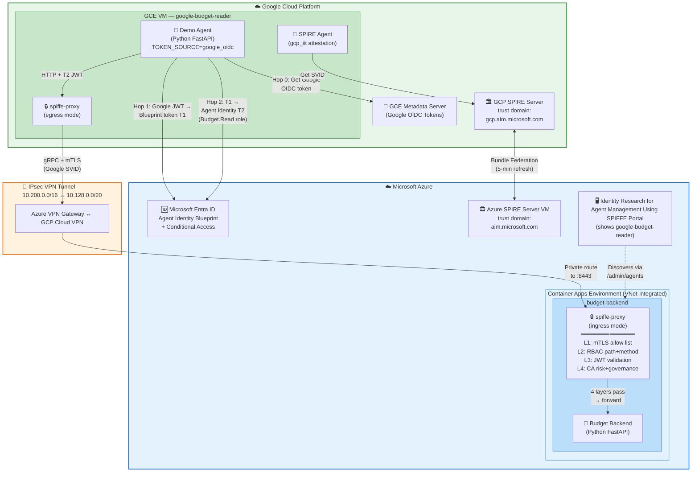
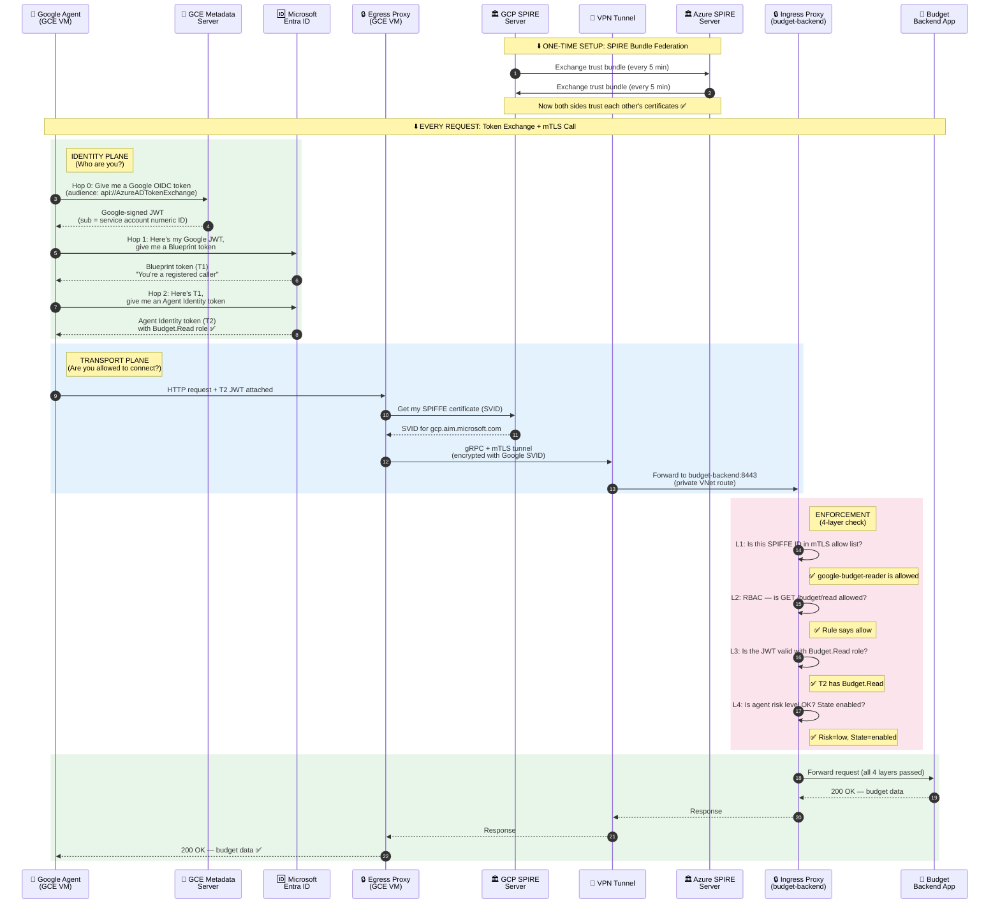

# Next: Google Cloud Agent via Entra + SPIFFE Federation

**Status:** Complete — Deployed and Validated
**Mode:** Hold Scope
**Target:** One Google-hosted read-only caller visible in the existing portal
**Supersedes:** Earlier broad cross-cloud federation assumptions and Azure-only caller assumptions
**Last updated:** 2026-04-03

## Executive Summary

Add one Google-hosted caller agent, `google-budget-reader`, that behaves like the existing onboarded callers but runs on GCP.

It must prove two different identity planes at the same time:

1. **Entra identity plane**
   - Google-native workload identity is exchanged into an **Entra Agent Identity** token through a **Blueprint-level Federated Identity Credential (FIC)**.
   - The caller stays secretless.
2. **SPIFFE transport plane**
   - The Google workload presents a **Google trust-domain SPIFFE ID** over mTLS to the Azure `budget-backend` sidecar through **SPIFFE federation**.

The portal must discover and render this Google caller through the **existing dynamic agent path**, not through a special-case UI.

This is the complete story for this feature. Not a platform rewrite. Not a generic multi-cloud agent framework. One real Google caller, one Azure target, same policy plane, same portal.

## Implementation Status

> **For the next engineer or AI picking this up:** Read this section first. It tells you exactly what's done, what's deployed, and what to do next.

### What Is Complete (Phase 1 — all 4 workstreams)

Phase 1 is **100% complete** with all unit tests passing. The live Azure environment runs `feature/crosscloud`.

| Workstream | Status | Commits | Tests |
|---|---|---|---|
| **A: Entra Provisioning** | ✅ Done | `f353f144` | Manual (script output verified) |
| **B: Credential Provider Strategy Pattern** | ✅ Done | `0087d80d` | 17 Python tests passing |
| **C: RBAC Schema Extension** | ✅ Done | `f353f144` | 14 Go tests passing |
| **D: Portal External-Agent Storage** | ✅ Done | `f353f144`, `650422af` | 11 Python tests passing |
| **Admin-CP Discovery** | ✅ Done | `f353f144` | Functional (integrated) |

**Key files changed:**

| File | What it does |
|---|---|
| `src/shared/entra_token_exchange.py` | `CredentialProvider` ABC → `AzureMIProvider` + `GoogleOIDCProvider`. `TOKEN_SOURCE` env var selects provider. `get_upstream_assertion(**kwargs)` for future providers. |
| `src/shared/test_credential_providers.py` | 17 unit tests: provider selection, Google metadata success/fail-closed (unreachable, timeout, error, empty), two-hop exchange with Google assertion, FIC mismatch, CA block, missing env vars. |
| `src/spiffe-proxy/internal/rbac/policy.go` | `FederatedPolicies []CallerPolicy` + per-entry `TrustDomain`. Validates separately from domestic policies. Exact `spiffe_id` only (no prefix for foreign domains). |
| `src/spiffe-proxy/internal/rbac/engine.go` | `findCallerPolicy()` searches `FederatedPolicies` after `Policies`. Logged when federated match found. |
| `src/spiffe-proxy/internal/rbac/engine_test.go` | 14 Go tests: happy/deny path, domestic isolation, unknown foreign ID, YAML parsing, missing trust_domain, prefix rejection, trust-domain mismatch, jwt_only, CA kill-switch, env enrichment. |
| `src/spiffe-proxy/config/spiffe-rbac-policy.yaml` | `federated_policies` section with `google-budget-reader` placeholder (OIDs need replacing with real values from provisioning script output). |
| `portal/app/storage/external_agent.py` | `BlobExternalAgentStore` (Azure Blob, ETag concurrency) + `FileExternalAgentStore` (local/dev). |
| `portal/app/storage/base.py` | `ExternalAgentStore` ABC with `list_agents`, `put_agent`, `delete_agent`, `healthcheck`. |
| `portal/app/routers/api.py` | `GET/PUT/DELETE /api/external-agents/{name}` + `POST /api/refresh-agents` (admin-only, cloud-mode only). |
| `portal/app/schemas/api.py` | `ExternalAgentEntry` Pydantic model: name, invoke_url, display_name, transport, hosting_platform. |
| `portal/app/settings.py` | External agent merge logic: overlays admin-CP discovery with external-agent store by name. |
| `portal/app/container.py` | `external_agent_store` wired into DI container. |
| `portal/tests/test_external_agents.py` | 11 tests: PUT/GET/DELETE, overwrite, delete nonexistent, empty store, corrupt file, filtered entries, healthcheck, multiple agents, transport field, blob retry on 412. |
| `src/admin-control-plane/app.py` | `/admin/agents` reads `federated_policies` from sidecar, returns federated callers with `role: federated-caller` and `hosting_platform` inferred from trust domain. |
| `scripts/add-google-agent.sh` | 6-step provisioning: create Entra Agent Identity, Blueprint FIC (Google issuer, numeric SA ID), mTLS allow list update, portal external-agent registration. Prints `federated_policies` YAML stanza. |

### Full Test Suite Results (as of 2026-04-03)

```
                                  Passed   Failed   Skipped
Go unit tests (3 packages)           91        0         2 pkgs (private tunnelpb dep)
Python credential providers          17        0         0
Python JWT validator                 14        0         0
Python agent apps                    16        0         0
Portal tests (5 files)               34        0         0
Portal policy merge                   5        1         0  (pre-existing, unrelated)
─────────────────────────────────────────────────────────────
TOTAL                               177        1         2 Go pkgs
```

The 1 failure is a pre-existing test bug in `portal/test_policy_merge.py` (expects a wildcard deny rule; the engine correctly uses `default_action: deny` instead). Not related to cross-cloud work.

### E2E QA Guidance

After changing the token exchange provider path, run `./deploy.sh --skip-provision` and `python3 scripts/test_agents.py` against a disposable environment to confirm the refactored token path works with real Azure managed identity tokens.

**Key thing to verify:** Agent logs should show `"Acquiring upstream assertion via AzureMIProvider..."` instead of the old `"Acquiring MI token for token exchange..."`. If you see the old message, deploy.sh didn't copy the updated `src/shared/entra_token_exchange.py`.

### Phase 0, 2, 3 — All Complete

| Phase | What | Status |
|---|---|---|
| **Phase 0** | VNet-integrate ACA | ✅ Deployed |
| **Phase 0** | Azure VPN Gateway + GCP Cloud VPN | ✅ Deployed |
| **Phase 0** | GCE VM provisioned | ✅ Deployed |
| **Phase 0** | TCP connectivity verified | ✅ Validated |
| **Phase 2** | Demo-agent on GCE with TOKEN_SOURCE=google_oidc | ✅ Deployed |
| **Phase 2** | SPIRE bundle federation (Azure ↔ GCP) | ✅ Active |
| **Phase 2** | spiffe-proxy on GCE (extracted from Docker) | ✅ Running |
| **Phase 3** | Validation matrix (6/6 scenarios) | ✅ All passed |

### How to Deploy

The cross-cloud Google agent is deployed via a single flag:

```bash
azd env set GCP_PROJECT <your-gcp-project>
./deploy.sh --new --google
```

This runs 13 Google-specific steps (G1-G13) after the Azure deploy completes.
See GOOGLE-FEDERATION-HOWTO.md for details and troubleshooting.

### Phase 3 Validation Results (2026-04-04)

| # | Scenario | Result |
|---|---|---|
| 1 | Portal shows google-budget-reader | ✅ |
| 2 | GET /budget/read → 200 | ✅ |
| 3 | POST /budget/submit → 403 (RBAC deny) | ✅ |
| 4 | Remove from mTLS → blocked | ✅ |
| 5 | Risk=HIGH → 403 (CA enforcement) | ✅ |
| 6 | Risk reset → 200 (recovery) | ✅ |

### Cross-Platform Notes for Future Implementers

Three platform learnings docs exist under `docs/platform-learnings/`:

- **Google** — `gcp_iit` attestation, FIC numeric subject, TOFU model
- **AWS** — `aws_iid` attestation, Cognito OIDC intermediary (EC2 has no native OIDC), IMDSv2 hop limit
- **ServiceNow** — SaaS vs MID Server, no SPIFFE layer, Agent User secretless pattern, per-instance issuers

The Google implementation was designed to not close off these platforms. Key extensibility points:

- `CredentialProvider.get_upstream_assertion(**kwargs)` — accepts credentials for ServiceNow
- `federated_policies` schema — `spiffe_id` can be made optional with `jwt_only: true` for ServiceNow Model A
- Portal external-agent store — `transport` field distinguishes `spiffe` from `https_only`

## Architecture Overview

This section explains the end-to-end call flow for a Google Cloud agent calling the Azure budget-backend. Two independent identity planes run in parallel — both must succeed for the request to go through.

### System Architecture Diagram

The system spans two clouds connected by an IPsec VPN tunnel. The Google agent runs on a GCE VM with its own SPIRE server. The Azure budget-backend runs on Container Apps with a SPIFFE ingress proxy that enforces four security layers.



### Request Flow (Sequence Diagram)

This diagram shows the complete step-by-step flow when the Google agent makes a single request to `GET /budget/read`. It's divided into four phases:

1. **Identity plane (green)** — The 3-hop secretless token exchange. The Google agent gets a native OIDC token from the GCE metadata server, exchanges it for an Entra Blueprint token, then exchanges that for an Agent Identity token with the `Budget.Read` role.

2. **Transport plane (blue)** — The SPIFFE mTLS tunnel. The egress proxy on the GCE VM gets a Google-domain SVID certificate, opens an encrypted gRPC tunnel through the IPsec VPN to the Azure ingress proxy.

3. **Enforcement (pink)** — The Azure ingress proxy runs four checks in sequence: is this SPIFFE ID in the mTLS allow list? Does RBAC allow this path and method? Is the JWT valid with the right roles? Is the agent risk level acceptable?

4. **Response (green)** — If all four layers pass, the request reaches the budget-backend app and the 200 OK flows back.



### Dual Identity Plane Design

The key architectural insight is that the Google agent must prove its identity through **two completely independent systems**:

| Plane | What it proves | Technology | Failure mode |
|---|---|---|---|
| **Identity** (Entra) | "I am `google-budget-reader` with `Budget.Read` role" | Google OIDC → Entra FIC → Agent Identity token (3 hops, secretless) | Token acquisition failure → 401 |
| **Transport** (SPIFFE) | "I am allowed to connect to budget-backend over mTLS" | SPIFFE SVID from `gcp.aim.microsoft.com`, verified via bundle federation | mTLS handshake failure → connection refused |

Neither plane can substitute for the other:

- A valid Entra token without a valid SPIFFE certificate → connection refused at Layer 1 (mTLS)
- A valid SPIFFE certificate without a valid Entra token → rejected at Layer 3 (JWT validation)
- Both valid but wrong role → rejected at Layer 2 (RBAC)
- Both valid but agent risk is high → rejected at Layer 4 (CA governance)

This is the same four-layer enforcement that Azure-hosted agents go through. The Google agent gets no special treatment — it must satisfy every layer, just like `budget-report` and `budget-approval`.

## Why This Is The Right Problem

The real job is not "do something with Google Cloud." The real job is to prove that Identity Research for Agent Management Using SPIFFE is not an Azure-only demo.

The user-visible outcome is concrete:

- a Google-hosted agent appears in the portal below `BudgetApproval`
- the portal can invoke it like any other caller
- it can call `GET /budget/read`
- it is denied on `/budget/submit`
- it uses Entra Agent Identity for token proof
- it uses SPIFFE federation for transport proof
- it stores no long-lived client secret or certificate

If we do nothing, the cross-cloud story remains a slide. That is a real product gap, not a hypothetical one.

## Success Criteria

1. `google-budget-reader` appears in the existing portal flow without a bespoke UI path.
2. The portal can execute a live request through the Google caller's `/call-backend-raw` endpoint.
3. `google-budget-reader -> GET /budget/read` returns `200`.
4. `google-budget-reader -> POST /budget/submit` returns `403` from the RBAC layer.
5. The caller acquires its Entra token without any stored client secret or client certificate.
6. The Azure target sees a **Google trust-domain SPIFFE ID** at the transport layer.
7. Risk, `agent_state`, and tag enforcement remain fail-closed for the Google caller.

## Not In Scope

- A generic provider-neutral external agent registry
- Cloud Run support
- GKE support
- Bidirectional Azure <-> Google caller/target support
- A new portal tab or a second management plane
- Full Terraform automation for the Google side in this pass
- Reworking the existing Azure agent topology

## Hard Constraints In The Current Repo

These are not theory. They fall directly out of the current code and docs.

### 1. `/admin/agents` is Azure-only for URLs today

`src/admin-control-plane/app.py` currently derives every agent URL from `CONTAINER_APP_ENV_DNS_SUFFIX`.

That works only for Azure Container Apps. A Google-hosted caller needs an explicit externally reachable invoke URL or the portal can render the agent but fail at live execution.

### 2. The portal execute path needs a caller URL

`portal/app/clients/agent_invoker.py` calls `caller_url + /call-backend-raw` and `caller_url + /call-agent`.

That means discovery must return a real public HTTPS base URL for the Google caller. This is not optional.

### 3. RBAC currently rejects foreign trust domains

`src/spiffe-proxy/internal/rbac/policy.go` validates caller SPIFFE IDs against the policy's local `trust_domain`.

That blocks a federated Google SPIFFE ID before evaluation starts. Cross-cloud SPIFFE support therefore requires a deliberate policy/schema change, not just a YAML update.

### 4. ACA public FQDN routing breaks the current mTLS tunnel

`docs/runbooks/hard-won-learnings.md` already records the core problem: using the Container App FQDN triggers TLS termination and breaks the sidecar's end-to-end mTLS assumptions.

For the Google caller to reach Azure over SPIFFE, it must reach the Azure sidecar's raw `8443` path **without** Azure TLS termination in the middle.

### 5. Security paths must still fail closed

Missing Graph data, bad FIC claims, unreachable bundle endpoints, broken risk lookup, or invalid JWTs cannot degrade to "safe enough." The repo standard is deny unless identity is positively proven.

## Chosen Architecture

### 1. Runtime Choice: GCE VM, Not Cloud Run, For The First Pass

Use a single GCE VM for the Google side.

Why:

- SPIRE's `gcp_iit` node attestor lines up with GCE instance identity tokens.
- We need local sidecar topology: app + `spiffe-proxy` + SPIRE agent.
- We need raw network control for the outbound mTLS tunnel.
- We need a stable public HTTPS endpoint for the portal's `caller_url`.
- This avoids turning the feature into "also decide the right GCP compute substrate."

Hold-scope decision: **one GCE VM is enough** for the first proof.

### 2. Identity Plane: Google OIDC -> Blueprint Token -> Agent Token

The existing repo already uses the two-hop Agent Identity flow:

```text
upstream credential -> Blueprint exchange token (T1) -> Agent Identity token (T2)
```

For Azure-hosted callers, the upstream credential is a Managed Identity token.

For the Google caller, replace only the first hop input.

```text
Google service account on GCE
  -> metadata server issues Google-signed ID token
     aud = api://AzureADTokenExchange

Google ID token
  -> Entra token endpoint
     client_id     = <Blueprint app ID>
     scope         = api://AzureADTokenExchange/.default
     fmi_path      = <Google caller Agent Identity client ID>
     client_assertion = <Google ID token>
  -> T1 (Blueprint exchange token)

T1
  -> Entra token endpoint
     client_id     = <Google caller Agent Identity client ID>
     scope         = api://<Blueprint app ID>/.default
     client_assertion = <T1>
  -> T2 (Entra Agent token used on the request)
```

### Blueprint Credential Shape

Add a new Blueprint-level FIC for the Google caller:

- `issuer = https://accounts.google.com`
- `subject = <Google service account unique ID>`
- `audiences = ["api://AzureADTokenExchange"]`

Important: the FIC belongs on the **Blueprint**, not the per-agent identity. That matches the current repo's Agent Identity model.

### 3. Transport Plane: Google SPIFFE Trust Domain Federated Into Azure

The Entra token proves who the agent is in the Microsoft auth plane.

It does **not** prove transport identity. That is a separate plane.

Use a Google trust domain for the caller, while keeping the same Entra identity path in the SPIFFE ID structure:

```text
spiffe://gcp.aim.microsoft.com/ests/bp/<blueprint-oid>/aid/<google-agent-oid>
```

That gives us:

- `gcp.aim.microsoft.com` = transport issuer domain
- `/ests/bp/.../aid/...` = same Entra identity bridge already used in Azure

The transport path is:

```text
Portal
  -> https://google-budget-reader.<public-domain>/call-backend-raw
  -> local spiffe-proxy :8080 on GCE
  -> gRPC + mTLS tunnel with Google SPIFFE SVID
  -> Azure-side ingress proxy on budget-backend :8443
  -> Layer 1 mTLS allow list
  -> Layer 4 CA checks
  -> Layer 2 RBAC
  -> Layer 3 JWT validation
  -> budget-backend app :8000
```

### 4. Network Requirement: Raw 8443 Reachability Comes First

This is the highest-risk part of the plan.

The Google side must reach the Azure ingress proxy in a way that **preserves** the sidecar's end-to-end TLS handshake.

**Engineering review decision:** The current ACA environment is **not** VNet-integrated. Even with a VPN to the Azure VNet, ACA internal DNS (`budget-backend`) is only resolvable inside the ACA environment. VNet integration of ACA is a prerequisite, not optional.

The approach is:

1. **VNet-integrate the Azure Container Apps environment** (modify `infra/modules/` Bicep to place ACA in a VNet subnet). Verify existing Azure agents still work after integration.
2. **Provision VPN connectivity** between the Azure VNet and GCP VPC (Azure VPN Gateway + GCP Cloud VPN).
3. Resolve `budget-backend` from the Google VM via the VNet-internal path.
4. Keep `TARGET_HOST=budget-backend` on the Google egress proxy so the tunnel does not route through ACA public TLS termination.

This should be treated as a **Phase 0 spike** before any token plumbing or portal work. Phase 0 is larger than originally scoped because ACA VNet integration is real infrastructure work, not just connectivity testing.

If Phase 0 fails, the team has learned something important: full cross-cloud SPIFFE to ACA is blocked by network topology, not by missing YAML.

### 5. Discovery Plane: Separate Authorization From Discovery Metadata

Do **not** add static env vars for external agent URLs.

The repo already learned why that fails.

**Engineering review decision:** Do **not** put `invoke_url` in the RBAC policy YAML. The Go sidecar ignores it, so it is management metadata that does not belong in the authorization config. Instead, use two separate data sources:

1. **RBAC policy YAML** (`federated_policies` section) defines authorization: SPIFFE ID, rules, CA settings. The Go sidecar uses this.
2. **Portal external-agent storage** (blob-backed, API-managed) defines discovery metadata: `invoke_url`, display name. The portal uses this.

The portal merges both sources by agent name at startup. Admin-CP returns agents from RBAC policy via `/admin/agents` (including `google-budget-reader`, no URL). The portal overlays `invoke_url` from its own storage.

The RBAC policy entry for the Google caller lives in the new `federated_policies` section:

```yaml
federated_policies:
  - spiffe_id: spiffe://gcp.aim.microsoft.com/ests/bp/<bp-oid>/aid/<agent-oid>
    trust_domain: gcp.aim.microsoft.com
    name: google-budget-reader
    entra_agent_id: <agent-oid>
    description: Google-hosted read-only caller
    ca:
      agent_state: enabled
      agent_tag: finance
    rules:
      - path: /budget/read
        methods: ["GET"]
        action: allow
        require_jwt: true
        required_roles: ["Budget.Read"]
      - path: /budget/submit
        methods: ["*"]
        action: deny
```

The portal's external-agent storage entry:

```json
{
  "name": "google-budget-reader",
  "invoke_url": "https://google-budget-reader.<public-domain>",
  "display_name": "Google Budget Reader"
}
```

Design intent:

- RBAC YAML stays pure authorization config. No management metadata leaks into the sidecar.
- Portal manages external agent config the same way it manages policy configs (blob storage, API-driven).
- Azure-hosted callers: `/admin/agents` still derives URL from ACA DNS. No external-agent entry needed.
- External callers: portal reads `invoke_url` from external-agent storage, merges with admin-CP discovery.
- A new `/api/refresh-agents` admin-only endpoint enables re-discovery without portal restart.

### 6. Trust-Domain Safety: Separate Federated Policies Section

Do **not** silently relax policy validation for all callers.

**Engineering review decision:** Instead of a per-policy `allow_foreign_trust_domain` boolean flag, use a separate `federated_policies` section in the RBAC YAML. This keeps the existing `Validate()` code untouched for domestic policies.

Schema extension:

- Add optional `TrustDomain` field to `CallerPolicy` struct (used only in `federated_policies` section).
- Add `FederatedPolicies []CallerPolicy` to the `Policy` struct.
- Validate `federated_policies` entries separately: require per-entry `trust_domain`, validate SPIFFE syntax, skip the global trust-domain prefix check.
- Extend `findCallerPolicy()` to search `FederatedPolicies` after `Policies`.
- Existing `Policies` validation is completely unchanged (regression-safe).

For this feature, use an **exact** `spiffe_id`, not a foreign `spiffe_id_prefix`.

Reason: the goal is one known Google caller, not authorization for an entire foreign trust domain subtree.

## Minimal Change Set That Still Achieves The Goal

This plan is not tiny, but it is still the smallest complete version of the feature.

### New Or Changed Repo Areas

1. `src/shared/entra_token_exchange.py`
   - Refactor to a strategy pattern: `CredentialProvider` base class with `get_upstream_assertion()`.
   - `AzureMIProvider`: wraps existing `ManagedIdentityCredential.get_token()`.
   - `GoogleOIDCProvider`: calls GCE metadata server. **Must fail closed** if metadata server is unreachable or returns an error.
   - Selection via `TOKEN_SOURCE` env var: `azure_mi` (default) | `google_oidc`.
   - Two-hop exchange code stays shared: provider gives upstream assertion, same Hop 1, same Hop 2.
   - **Cross-platform note:** `get_upstream_assertion()` should accept `**kwargs` for optional credentials. AWS (via Cognito) and ServiceNow may require stored credentials that Google and Azure do not. Don't hardcode the interface as secretless-only. See `docs/platform-learnings/ServiceNow-Federation.md`.

2. `src/spiffe-proxy/internal/rbac/policy.go`
   - Add optional `TrustDomain` field to `CallerPolicy` struct.
   - Add `FederatedPolicies []CallerPolicy` to the `Policy` struct.
   - Validate `federated_policies` entries separately (per-entry trust domain check, not global prefix check).
   - Existing `Policies` validation unchanged.
   - **Cross-platform note:** Consider making `spiffe_id` optional (not required) in `federated_policies` entries. ServiceNow platform agents have no SPIFFE transport layer and would need to match by JWT claims or agent name instead. Adding a `jwt_only: bool` field now avoids a schema migration later. See `docs/platform-learnings/ServiceNow-Federation.md`.

3. `src/spiffe-proxy/internal/rbac/engine.go`
   - Extend `findCallerPolicy()` to search `FederatedPolicies` after `Policies`.

4. `src/spiffe-proxy/config/spiffe-rbac-policy.yaml`
   - Add `federated_policies` section with the Google caller entry.

5. `src/admin-control-plane/app.py`
   - Read `federated_policies` from the `/mgmt/policy` response.
   - Return federated agents in `/admin/agents` with SPIFFE ID, name, role, but no URL (portal overlays from its own storage).
   - Continue ACA DNS derivation as the fallback for Azure agents.

6. `src/demo-agent/` (reuse, not a new `src/google-budget-reader/`)
   - Add `TOKEN_SOURCE` env var support. `google_oidc` selects `GoogleOIDCProvider`.
   - Same caller contract, same proxy config, same CA evaluator.

7. `portal/app/storage/` (new, follows existing blob pattern)
   - External-agent config store: blob-backed storage for `invoke_url` and display metadata.
   - Portal API: `PUT /api/external-agents` (admin-only), `GET /api/external-agents`.
   - Merge logic in `settings.py`: join admin-CP agents + external-agent storage by name.
   - New `/api/refresh-agents` admin-only endpoint for re-discovery without restart.
   - **Cross-platform note:** Include a `transport` field in the external-agent schema (`spiffe` | `https_only`). ServiceNow platform agents use HTTPS without mTLS, so the portal needs to know whether to expect Layer 1 enforcement results. Default to `spiffe` for Google/AWS.

8. `scripts/add-google-agent.sh` (new)
   - Create or resolve the Google caller Agent Identity under the existing Blueprint.
   - Create the Google FIC on the Blueprint using the Google service account **numeric unique ID** (NOT email — see Implementation Gotchas).
   - Add Google SPIFFE ID to budget-backend mTLS allow list via `PUT /mtls-policy`.
   - Register `invoke_url` in portal external-agent storage via portal API.
   - Emit the exact foreign SPIFFE ID and the `federated_policies` stanza.

9. `infra/modules/` (modified)
   - VNet-integrate the ACA environment (place in a VNet subnet).
   - Add VPN Gateway for cross-cloud connectivity.

### What We Explicitly Avoid

- No new portal frontend surface for "external agents"
- No `invoke_url` or management metadata in the RBAC policy YAML
- No `allow_foreign_trust_domain` boolean flag (use `federated_policies` section instead)
- No new `src/google-budget-reader/` directory (reuse `src/demo-agent/` with `TOKEN_SOURCE` param)
- No generic abstraction for every future cloud provider in this pass
- No new management proxy beyond the current portal -> admin-control-plane -> sidecar contract

## Implementation Sequence

### Phase 0: Infrastructure Prerequisites (blocks all other phases)

**Status:** Not started. This is the next thing to do.

Goal: VNet-integrate ACA, provision GCE, establish private connectivity, prove raw 8443 reachability.

Steps:

1. Modify `infra/modules/` Bicep to place ACA environment in a VNet subnet. Verify existing Azure agents still work.
2. Provision GCE VM: caller app + spiffe-proxy + SPIRE agent + SPIRE server (single VM for PoC). Public IP + firewall rules for portal `invoke_url` access (HTTPS 443).
3. Establish VPN tunnel: Azure VPN Gateway + GCP Cloud VPN. Private connectivity between Azure VNet and GCP VPC.
4. Validate: TCP connectivity from GCE VM to budget-backend:8443 via VNet private IP. No ACA public FQDN in the path.

Exit criteria:

- ACA VNet-integrated, existing agents functional
- TCP connectivity exists from GCE VM to budget-backend:8443 via private path
- No public ACA FQDN is in the tunnel path

### Phase 1: Identity + Schema (4 parallel workstreams after Phase 0)

> **✅ COMPLETE.** All 4 workstreams implemented and tested. See Implementation Status above for details.

**Workstream A:** Entra Provisioning — ✅ Done (`scripts/add-google-agent.sh`)

Goal: create the Google caller Agent Identity, FIC, and register with mTLS + portal.

- `scripts/add-google-agent.sh`: Create Agent Identity under existing Blueprint, create Blueprint-level FIC (Google issuer), add Google SPIFFE ID to mTLS allow list via `PUT /mtls-policy`, register `invoke_url` in portal external-agent storage.

Exit criteria: Google metadata token can complete Hop 1. Hop 2 returns an Entra Agent token. mTLS allow list contains Google SPIFFE ID.

**Workstream B:** Credential Provider Strategy Pattern (parallel with A) — ✅ Done

Goal: refactor token exchange to support Google OIDC as an upstream assertion source.

- Refactor `src/shared/entra_token_exchange.py` to strategy pattern.
- `GoogleOIDCProvider` calls GCE metadata server, fails closed if unreachable.
- Selection via `TOKEN_SOURCE` env var.

Exit criteria: Unit tests pass for both `AzureMIProvider` and `GoogleOIDCProvider`. ✅ 17 tests passing.

**Workstream C:** RBAC Schema Extension (parallel with A and B) — ✅ Done

Goal: add `federated_policies` to policy schema.

- Extend `CallerPolicy` with per-entry `TrustDomain` field.
- Add `FederatedPolicies` to `Policy` struct.
- Validate separately, extend `findCallerPolicy()` to search both slices.
- Add `federated_policies` entry in `spiffe-rbac-policy.yaml`.

Exit criteria: Go unit tests pass for parsing, validation, and matching of federated policies. ✅ 14 tests passing.

**Workstream D:** Portal External-Agent Storage (parallel with A, B, C) — ✅ Done

Goal: add blob-backed external-agent config storage and agent refresh.

- New storage model in `portal/app/storage/`.
- Portal API: `PUT/GET /api/external-agents` (admin-only).
- Merge logic in `settings.py`: join admin-CP agents + external-agent storage by name.
- New `/api/refresh-agents` admin-only endpoint.

Exit criteria: Python unit tests pass for storage CRUD, merge logic, and refresh endpoint. ✅ 11 tests passing.

### Phase 2: Google Runtime + Federation (depends on Phase 0 + Workstreams B, C)

**Status:** Not started. Blocked by Phase 0.

Goal: run one Google caller stack on GCE, establish SPIFFE bundle federation.

Steps:

1. Deploy `src/demo-agent/` on GCE with `TOKEN_SOURCE=google_oidc`. Configure spiffe-proxy egress to point at budget-backend private IP:8443. Set up HTTPS reverse proxy (nginx/caddy) for public `invoke_url` endpoint on :443.
2. Verify standalone token exchange from GCE: Google metadata -> Hop 1 -> Hop 2. Verify fail-closed on FIC mismatch.
3. Configure SPIRE bundle federation: both servers exchange bundle endpoint URLs, 5-minute explicit refresh interval, mutual trust.
4. Update admin-control-plane: read `federated_policies` from `/mgmt/policy`, return federated agents in `/admin/agents`.

Exit criteria:

- Google caller receives a Google trust-domain SVID
- Azure side accepts that foreign SPIFFE ID when explicitly allow-listed
- `/admin/agents` returns `google-budget-reader` with SPIFFE ID and name

### Phase 3: Validation Matrix

**Status:** Not started. Blocked by Phase 2.

Goal: prove the full happy path and the main deny paths.

All 8 integration tests from the Validation Matrix section below must pass.

## Failure Modes And Expected Behavior

| Failure | Expected Result | Why |
|---|---|---|
| Google metadata token unavailable | caller returns `401 token_acquisition_failed` | no secret fallback |
| Google FIC subject or issuer mismatch | Hop 1 fails, request denied | identity not proven |
| Blueprint -> Agent exchange fails | request denied | agent token not proven |
| SPIFFE bundle endpoint unreachable | mTLS handshake fails | transport identity not proven |
| Google path routes through ACA public TLS termination | mTLS tunnel fails | sidecar cert exchange broken |
| Policy omits `invoke_url` for external agent | portal cannot execute caller | discovery incomplete |
| Portal external-agent store unavailable | fall back to cached, degrade gracefully | fail closed on writes, cached on reads |
| Graph/risk lookup unavailable | deny at CA layer | fail closed |
| Google caller removed from mTLS allow list | connection rejected before RBAC | Layer 1 still authoritative |

## Validation Matrix

1. Portal shows `google-budget-reader` as a new caller.
2. `google-budget-reader -> GET /budget/read` returns `200`.
3. `google-budget-reader -> POST /budget/submit` returns `403`.
4. Removing the Google SPIFFE ID from the mTLS allow list blocks the connection.
5. Setting the Google caller risk to `high` returns `403`.
6. Setting `ca.agent_state: disabled` returns `403`.
7. Breaking the Google FIC subject causes token acquisition failure.
8. Breaking bundle federation causes transport failure.

## Lessons Learned Applied Up Front

1. **Do not hardcode dynamic URLs in env vars.** External invoke URLs must flow through live discovery data.
2. **Do not treat token federation and SPIFFE federation as the same thing.** They solve different trust problems.
3. **Do not assume ACA public FQDNs preserve the sidecar tunnel.** The repo already knows they do not.
4. **Do not use `azd deploy <service>` on sidecar-bearing Azure services.** Re-attestation rules still apply.
5. **Do not interpret missing Graph or governance data as safe.** External callers do not get a lower bar.

## Implementation Gotchas

These are concrete debugging-savers for whoever implements this plan.

### FIC Subject Must Be Numeric Unique ID, Not Email

When creating the Federated Identity Credential on the Blueprint for the Google caller, the `subject` field **must** be the GCP service account's **numeric unique ID**, not the email address. GCP identity tokens use `sub: "100330114984..."` (numeric). Using the email (e.g., `gcp-agent@project.iam.gserviceaccount.com`) produces `AADSTS70021: No matching federated identity record found`.

Resolve the correct value with:
```bash
gcloud iam service-accounts describe $GCP_SA_EMAIL --format 'value(uniqueId)'
```

### MSAL Python Does Not Support FIC Token Exchange

MSAL Python lacks the `WithClientAssertion` callback needed for Federated Identity Credential flows. The `GoogleOIDCProvider` must use raw HTTP requests to the Entra token endpoint, not MSAL. This is compatible with our strategy pattern design. The existing `entra_token_exchange.py` already uses raw HTTP for the two-hop exchange, so no new pattern is introduced.

### Use `az vm run-command create`, Not `az vm run-command invoke`

The legacy `az vm run-command invoke` has no server-side timeout and is single-slot. A stuck command permanently blocks the VM. Always use `az vm run-command create --timeout-in-seconds <N>` when running commands on the SPIRE Server VM.

See hard-won-learnings.md #20 and `scripts/lib/azure-helpers.sh` for the safe `azure_vm_run()` wrapper.

### No `proxy-only` CONTAINER_MODE Exists

The spiffe-proxy entrypoint currently supports only `server` and `agent-proxy` modes. For the GCP SPIRE federation plan (Option B), the GCP-side proxy needs to connect to an **external** SPIRE Agent socket rather than starting its own. This will require either:
- Adding a `proxy-only` mode to `entrypoint.sh` that skips SPIRE Agent startup and uses `WORKLOAD_API_ADDR` to connect to an existing socket, OR
- Running `agent-proxy` mode but pointing it at the GCP SPIRE Server instead of the Azure one (viable if using join tokens on the GCP side, but we chose `gcp_iit` attestation via a separate SPIRE Agent).

This is a code gap that must be addressed in Phase 2.

### Container App Updates Can Nuke Other Containers

Never use `az containerapp update --set-env-vars` to change a single env var. Azure may reset other containers in the revision to placeholder images. Always:
1. Export full Container App YAML: `az containerapp show -n <name> -g <rg> -o yaml > /tmp/app.yaml`
2. Edit the YAML (update env vars, remove `revisionSuffix` or set unique value)
3. Reimport: `az containerapp update -n <name> -g <rg> --yaml /tmp/app.yaml`

See hard-won-learnings.md for the full context.

## Open Questions

1. ~~What is the cleanest private network path from GCE to the Azure sidecar's raw `8443` listener?~~ **Resolved:** VNet-integrate ACA + VPN Gateway to GCP.
2. Is one GCE VM enough operationally for the Google SPIRE server in the PoC, or does the team want it split before implementation?
3. Should the portal eventually show a `hosting_platform` badge, or is the `google-*` naming convention enough for this pass?

## Approval Requested

Approve this plan if these decisions stand:

1. **Use GCE for the first Google caller.**
2. **Use a separate `federated_policies` section in RBAC YAML for foreign trust domains** (not a per-policy `allow_foreign_trust_domain` flag).
3. **Use portal external-agent storage (blob, API-managed) for `invoke_url`** (not in RBAC YAML).
4. **Reuse `src/demo-agent/` with `TOKEN_SOURCE` param** (not a new agent directory).
5. **Use strategy pattern for credential providers** (`CredentialProvider` base with `AzureMIProvider` + `GoogleOIDCProvider`).
6. **VNet-integrate ACA + VPN to GCP** as the Phase 0 prerequisite for raw 8443 reachability.
7. **Treat Phase 0 as larger than originally scoped** (ACA VNet integration is real infra work).

If approved, the next step is implementation planning against this exact scope, not reopening the feature definition.

## Engineering Review Decisions

The following decisions were made during the engineering review (April 2, 2026):

| # | Original Plan | Review Decision | Rationale |
|---|---|---|---|
| 1 | "Add private network connectivity" (underspecified) | VNet-integrate ACA + VPN to GCP | ACA not VNet-integrated today. Internal DNS unreachable without it. |
| 2 | `allow_foreign_trust_domain` boolean per CallerPolicy | Separate `federated_policies` YAML section | Cleaner separation. Existing Validate() untouched. |
| 3 | `invoke_url` in RBAC policy YAML | Portal external-agent storage (blob, API-managed) | Keeps RBAC YAML as pure auth config. Sidecar ignores management metadata. |
| 4 | New `src/google-budget-reader/` OR reuse demo-agent | Reuse demo-agent with `TOKEN_SOURCE` env var | DRY. Same caller contract, swap upstream credential only. |
| 5 | "Make the first hop pluggable" (underspecified) | Strategy pattern: `CredentialProvider` base class | Extensible for future providers. `AzureMIProvider` + `GoogleOIDCProvider`. |
| 6 | mTLS allow list population not specified | Script-driven via `add-google-agent.sh` calling `PUT /mtls-policy` | Consistent with how deploy.sh handles Azure agents. |
| 7 | Portal caches at startup (restart required) | Accept restart + add `/api/refresh-agents` endpoint | Pragmatic for PoC, operational improvement for ongoing use. |
| 8 | SPIRE bundle refresh interval not specified | 5-minute explicit config (not relying on default) | Visible and documented. |

## Test Plan

### Unit Tests (18 paths)

**Go (add to existing test files in `src/spiffe-proxy/internal/rbac/`):**

1. `policy_test.go`: `federated_policies` YAML parses correctly
2. `policy_test.go`: `Validate` accepts valid foreign trust domain in federated section
3. `policy_test.go`: `Validate` rejects missing `trust_domain` on federated entry
4. `policy_test.go`: `Validate` still rejects foreign domain in regular `policies` (regression)
5. `policy_test.go`: `FederatedPolicies` field is optional (existing YAML still works)
6. `engine_test.go`: `findCallerPolicy` matches in `federated_policies`
7. `engine_test.go`: `findCallerPolicy` prefers `policies` over `federated_policies` on overlap
8. `engine_test.go`: `findCallerPolicy` returns nil when no match in either slice
9. `engine_test.go`: Full `Evaluate` with federated caller, both allow and deny paths

**Python (new test files):**

10. `test_credential_providers.py`: `GoogleOIDCProvider` success (mocked GCE metadata)
11. `test_credential_providers.py`: `GoogleOIDCProvider` metadata server unreachable -> fail closed
12. `test_credential_providers.py`: `GoogleOIDCProvider` metadata error response -> fail closed
13. `test_credential_providers.py`: `AzureMIProvider` refactored path still works
14. `test_entra_token_exchange.py`: Two-hop exchange with Google assertion (mocked)
15. `test_entra_token_exchange.py`: FIC mismatch -> clear error propagation
16. `test_external_agents.py`: Portal external-agent storage PUT/GET
17. `test_external_agents.py`: Merge logic (admin-CP agents + external storage by name)
18. `test_external_agents.py`: Refresh endpoint re-discovers and merges

### Integration / E2E Tests (8 scenarios from Validation Matrix)

1. Portal shows `google-budget-reader` as a caller
2. `google-budget-reader -> GET /budget/read` -> `200`
3. `google-budget-reader -> POST /budget/submit` -> `403`
4. Remove Google SPIFFE ID from mTLS allow list -> connection rejected
5. Set Google caller risk to `high` -> `403`
6. Set `ca.agent_state: disabled` -> `403`
7. Break Google FIC subject -> token acquisition failure
8. Break bundle federation -> transport failure

## Worktree Parallelization Strategy

| Step | Modules Touched | Depends On |
|---|---|---|
| Phase 0: Infra | `infra/`, `scripts/` | — |
| Workstream B: Token exchange | `src/shared/` | — |
| Workstream C: RBAC schema | `src/spiffe-proxy/` | — |
| Workstream D: Portal storage | `portal/` | — |
| Workstream A: Entra provisioning | `scripts/` | Phase 0 |
| Phase 2 steps 1-2: GCE runtime | `src/demo-agent/`, GCE | Phase 0, Workstream B |
| Phase 2 step 3: SPIFFE federation | SPIRE config | Phase 0, Phase 2 step 1 |
| Phase 2 step 4: Admin-CP update | `src/admin-control-plane/` | Workstream C |
| Phase 3: Validation | `tests/` | All above |

**Parallel lanes:**

- **Lane A:** Phase 0 infrastructure (ACA VNet + GCE + VPN)
- **Lane B:** Workstream B credential provider strategy pattern (parallel with A)
- **Lane C:** Workstream C RBAC `federated_policies` schema (parallel with A, B)
- **Lane D:** Workstream D portal external-agent storage (parallel with A, B, C)
- **Sequential after A completes:** Workstream A (Entra provisioning), GCE runtime, SPIFFE federation
- **Sequential after C completes:** Admin-CP update
- **Final:** Phase 3 validation after all lanes merge

4 parallel lanes, 3 sequential phases.
